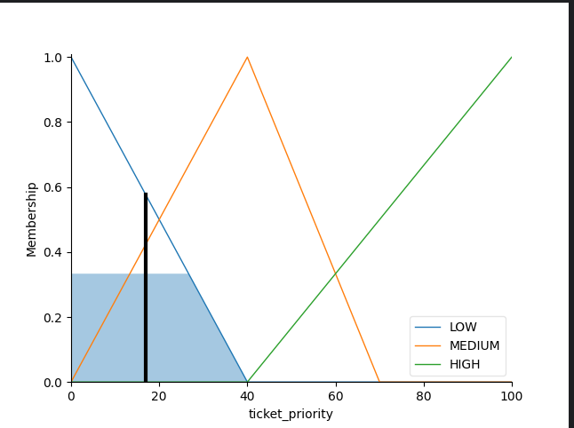
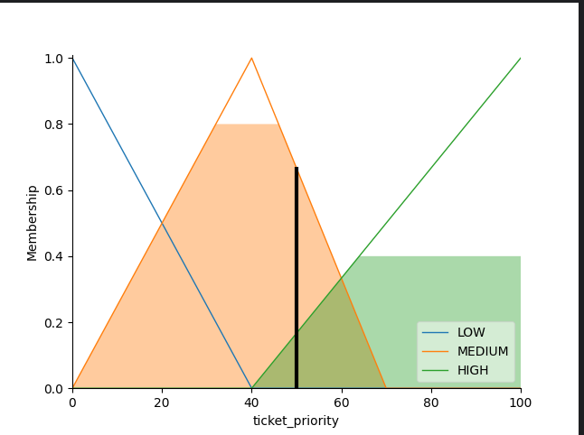
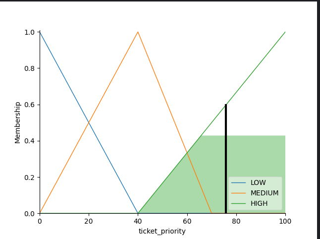

# Autor
Michał Cichowski s20695
# System Logiki Rozmytej do Priorytetyzacji Zgłoszeń

Ten skrypt w Pythonie implementuje system logiki rozmytej do określania priorytetu zgłoszenia na podstawie ważności klienta, powagi zgłoszenia i istotności zgłoszenia. System korzysta z trójkątnych funkcji przynależności oraz określonych reguł do wyliczania priorytetu zgłoszenia.

## Sposób Użycia

1. Uruchom skrypt `fuzzy.py`.
2. Wprowadź ważność klienta, powagę zgłoszenia i istotność zgłoszenia, gdy zostaniesz o to poproszony.
3. System obliczy priorytet zgłoszenia i wyświetli wynik.

## Przykładowe Wyniki

### Niski Priorytet


### Średni Priorytet


### Wysoki Priorytet


## Jak Działa System

System logiki rozmytej definiuje etykiety lingwistyczne ('NISKI', 'ŚREDNI', 'WYSOKI') dla zmiennych wejściowych i wyjściowych i wykorzystuje trójkątne funkcje przynależności do modelowania ich zależności. Reguły oparte na tych etykietach określają poziom priorytetu zgłoszenia.

## Wymagania

Aby zainstalować wymagane biblioteki, uruchom:

```bash
pip install -r requirements.txt
