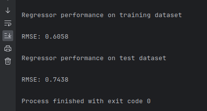
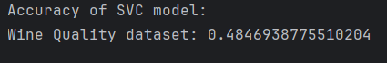
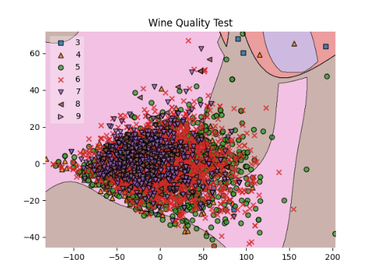
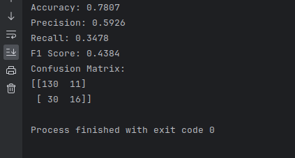
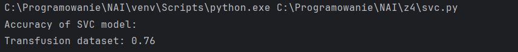
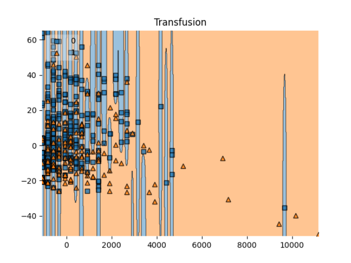

# Decision Tree and SVM

## Requirements

``pip install -r requirements.txt``

- NumPy
- scikit-learn

## Examples

### Wine Quality Dataset

#### Decision Tree

#### SVC

#### Graph

### Transfusion Training Dataset

#### Decision Tree

##### SVC

#### Graph

# Author
- Michał Cichowski
