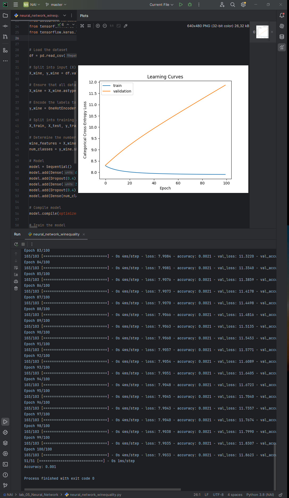

# TensorFlow Neural Network Projects

This repository contains several Python scripts and datasets for building and running TensorFlow-based neural network models. Each script is designed for different tasks, such as image classification and quality prediction. Below are detailed explanations for each script, the datasets they use, and the resulting output images.

---

## Animals Classification (`animals.py`)

**Description:**  
This script classifies images of animals using a TensorFlow neural network.  
**Output:**  
The resulting image is saved as `animals.png`.


---

## Fashion Classification (`fashion.py`)

**Description:**  
This script performs image classification on the Fashion MNIST dataset using a neural network.  
**Output:**  
The resulting image is saved as `fashion.png`.


---

## Dog Image Prediction (`read_image.py`)

**Description:**  
Reads and processes an image for object classification using a neural network.  
**Output:**  
The resulting prediction is saved as `dog_prediction.png`.


---

## Wine Quality Prediction (`neural_network_winequality.py`)

**Description:**  
Trains a neural network to predict wine quality based on the dataset `winequality-white.txt`.  
**Output:**  
The resulting image showing the training process or predictions is saved as `wine_quality.png`.



---


## Setup Instructions

To run the scripts, you need to have the following dependencies installed:

## Author
Michał Cichowski s20695
```bash
pip install numpy matplotlib tensorflow scikit-learn pandas