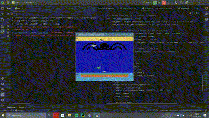

# Deep Q-Network Agent for NameThisGame (Atari)

## 🎮 Overview
This project implements a **Deep Q-Network (DQN) Agent** that learns to play **NameThisGame** from Atari using reinforcement learning.




## Installation
```bash
pip install gymnasium[atari] torch numpy ale-py
```

## Usage
Run the following command to start training the agent:
```bash
python bot.py
```

## Description
- The agent observes the game screen and selects actions.
- Uses **DQN with experience replay** to optimize decisions.
- Over time, it improves gameplay performance.

## Files
- `bot.py` - Main script containing the agent and training loop.
- `requirements.txt` - Dependencies needed to run the project.

## References
- [Gymnasium Atari Documentation](https://gymnasium.farama.org/environments/atari/)
- [Deep Q-Network (DQN) Paper](https://www.nature.com/articles/nature14236)

---
**Author:** Michał Cichowski (s20695)
